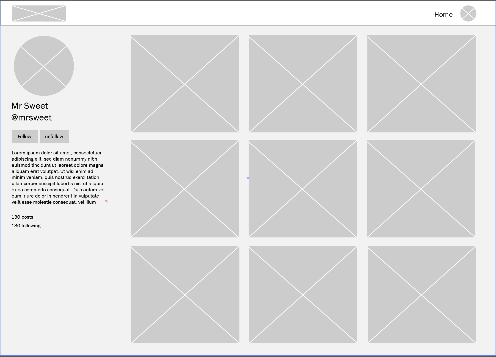
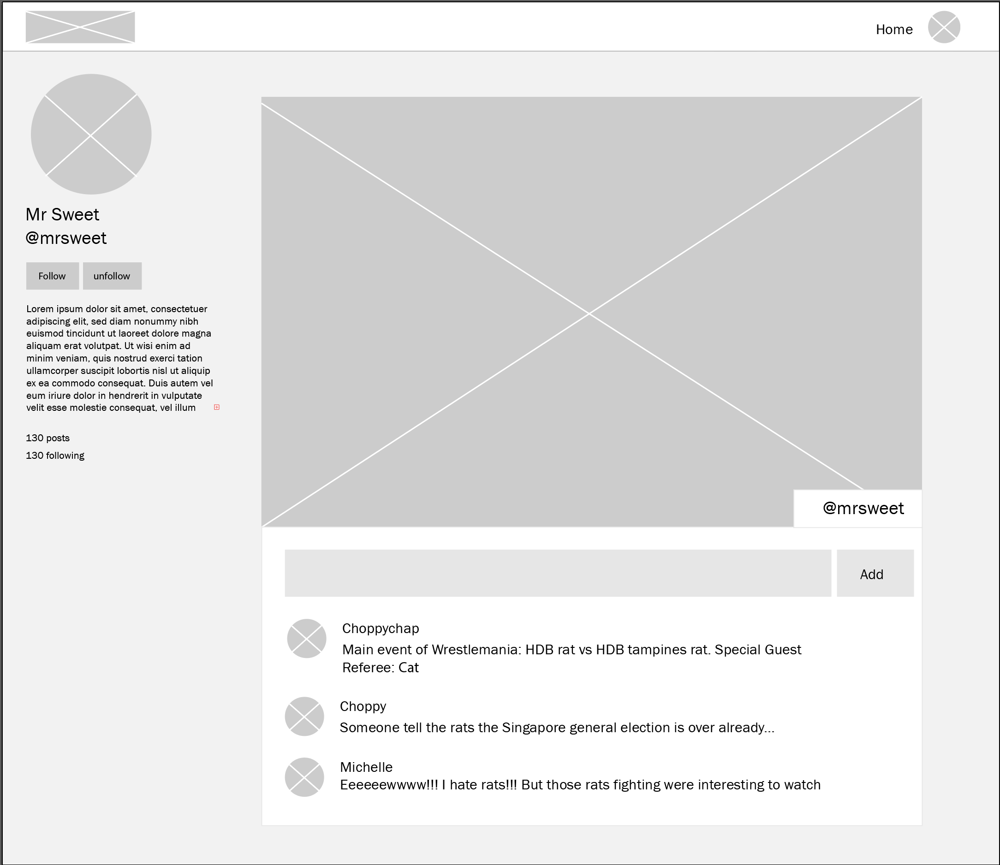

# 

## React/Node - Full day team challenge - Instagram Clone

The aim of today's challenge is to build an Instagram clone. This clone should have the following features:

1. User should be able to create a post. Post can contain only an image or text or both. [image upload](https://medium.com/@mahesh_joshi/reactjs-nodejs-upload-image-how-to-upload-image-using-reactjs-and-nodejs-multer-918dc66d304c)
1. Users should be able to comment on post created
1. User should be able to follow other users
1. User must be logged in to view application.
1. User must signup with firstname, lastname, username, email, phone, password, address, city and country.
1. User should have a description of themselves on their profile. This can be set after user has signed up.

As a development team, tasks must be shared evenly across all members of the team to facilitate learning.

#### All requirements are subject to change.

### Deliverable

1. A complete model structure image showing how your team came about the database structure.
1. Trello/clickup/monday/jira board showing how tasks were broken down.
1. Commit history showing what each member on the team accomplished. Note: commit messages must be meaningful i.e. signup  with information completed.
1. Web app must responsive. all major screen sizes.
1. Working app with all features.

### UI Wireframes

#### User Profile and Home page

#### Posts page

### Bonus Tasks

1. User should be able add hashtags to post.

### Authors
1. Ebere Iweala
1. Tristan Calleja